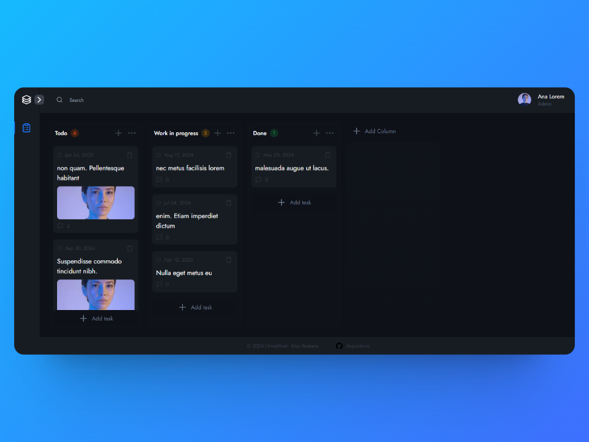

# HIVEMIND


HIVEMIND es una demo de un sistema para el manejo de tareas que se enfoca principalmente en el diseño moderno y atractivo. Utiliza tecnologías web modernas para ofrecer una experiencia de usuario fluida e interactiva. El sistema está diseñado para permitir a los usuarios gestionar sus tareas de manera eficiente y efectiva, brindando una interfaz visualmente agradable y fácil de usar. Además, se espera que el sistema sea escalable, lo que significa que puede adaptarse y crecer para satisfacer las necesidades de una base de usuarios en crecimiento.

## Demo

[URL HiveMind](https://hivemind-psi.vercel.app/)

## Tecnologias

- Next.js
- React.js
- TypeScript
- TailwindCSS
- ESLint
- Prettier

## Empezando

Primero, ejecute el servidor de desarrollo:

```bash
npm run dev
# or
yarn dev
# or
pnpm dev
# or
bun dev
```

Abra [http://localhost:3000](http://localhost:3000) con su navegador para ver el resultado.
